# Frontend Implementation of Assigned Task  

This is the frontend implementation of the assigned task.  
The website is **fully responsive** and built using **HTML, CSS, and JavaScript**.  

## 🌟 Features  
- Fully responsive design  
- Built with HTML, CSS, and JavaScript  
- Modern UI/UX  

## 📸 Screenshots  

### **Tablet View**  
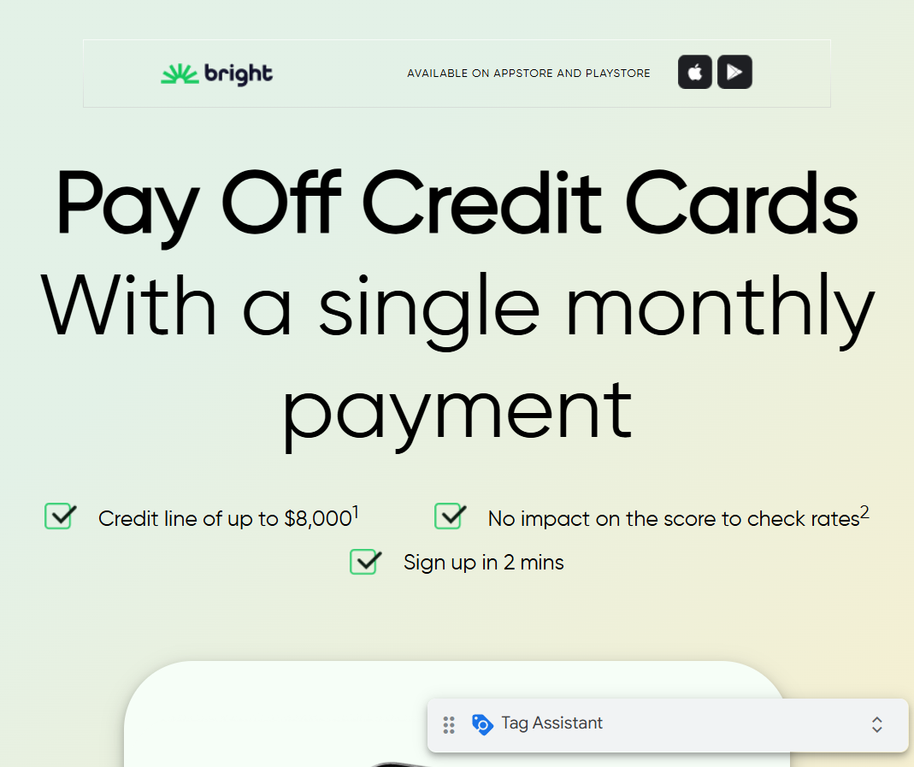
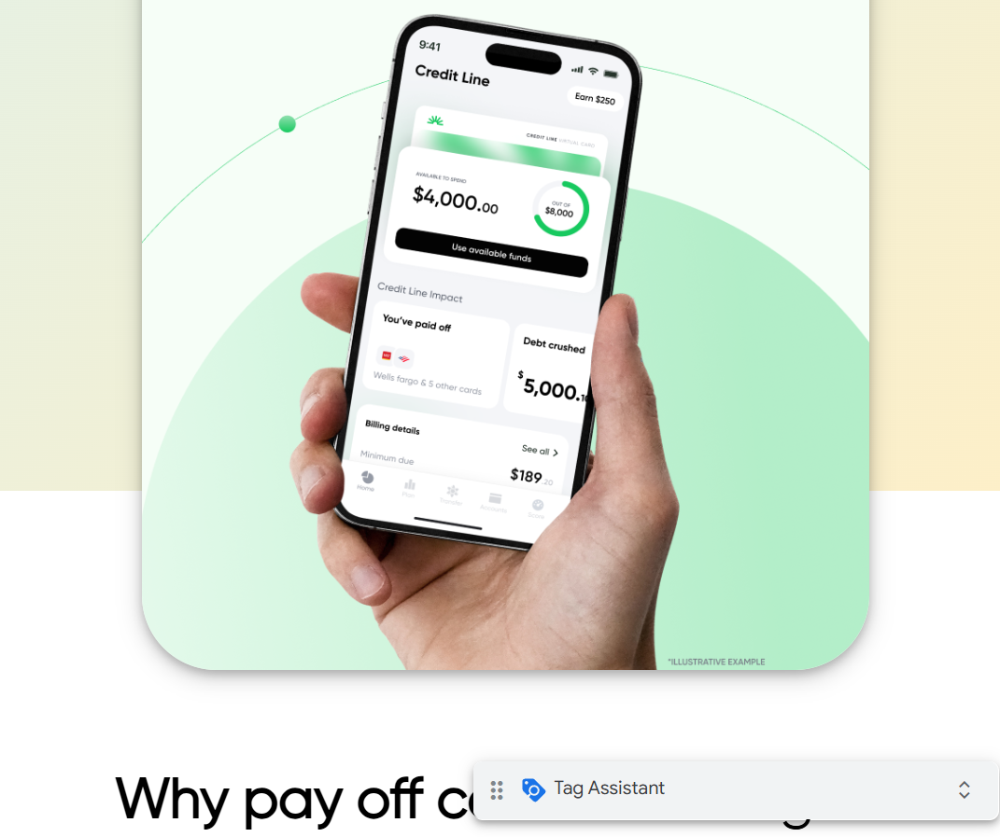
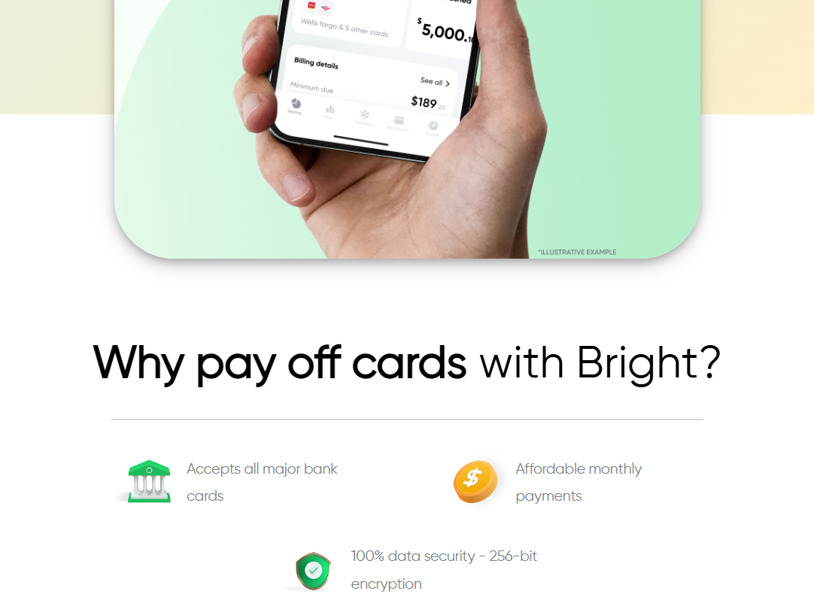
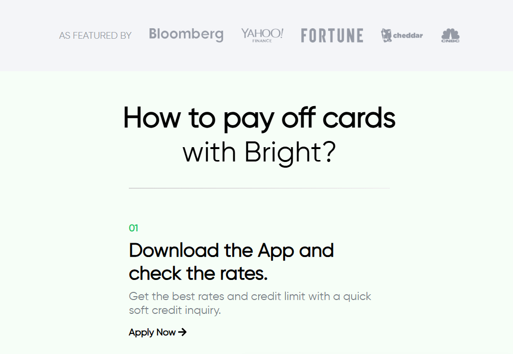
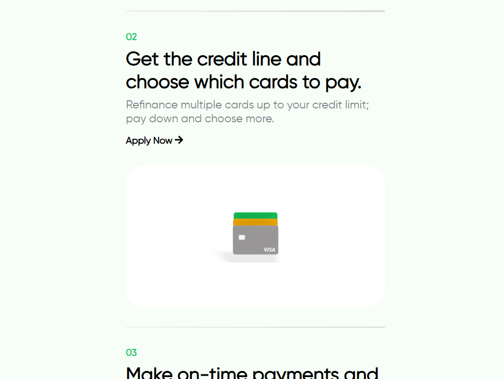
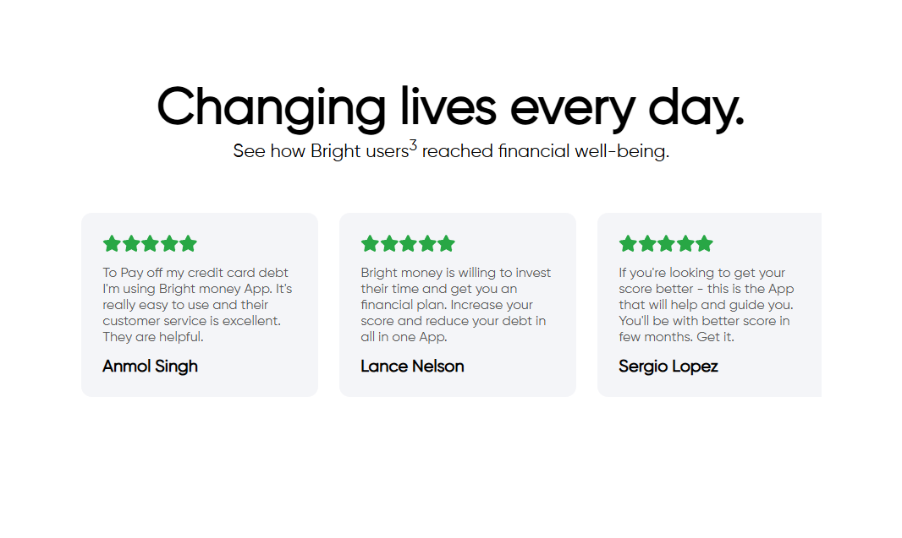
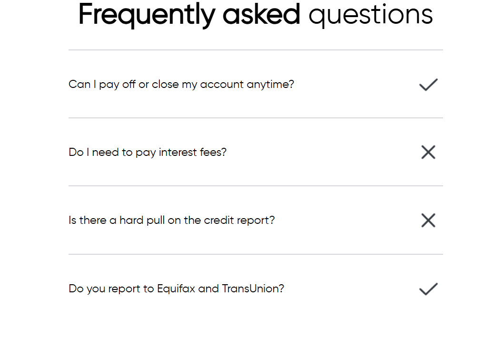
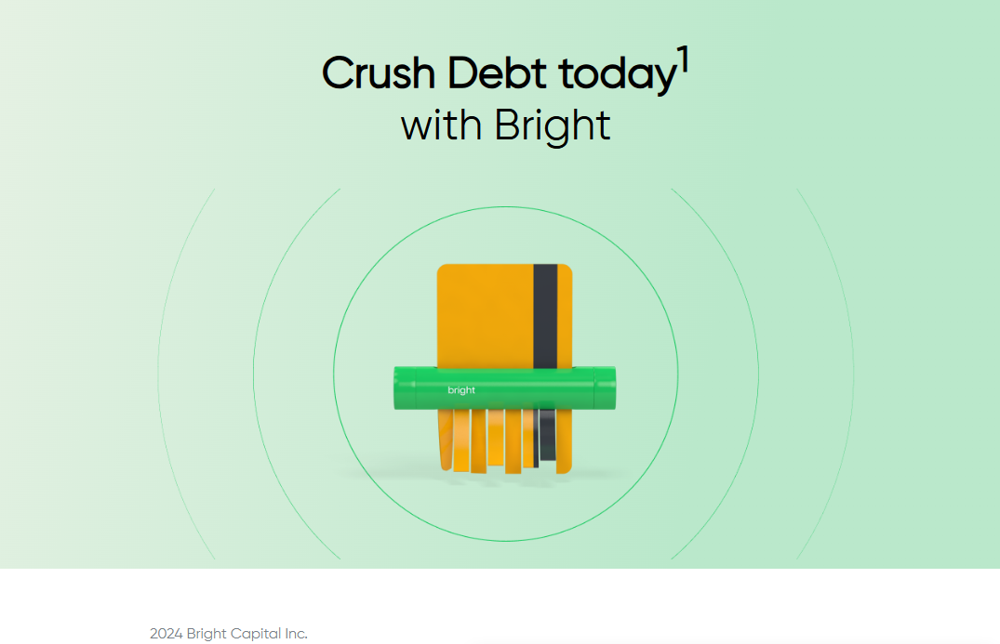
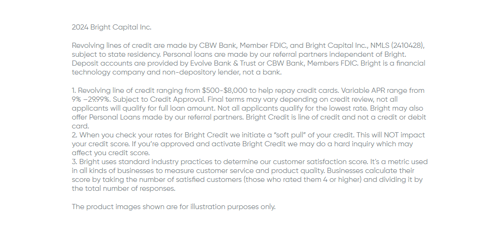

### **Mobile View**  
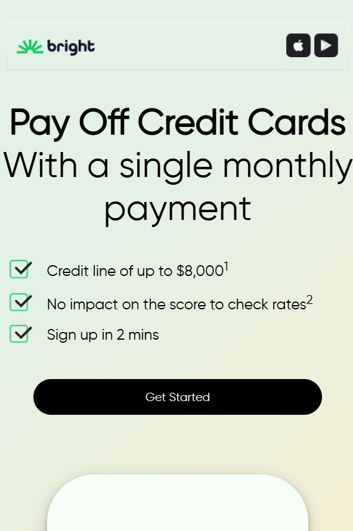
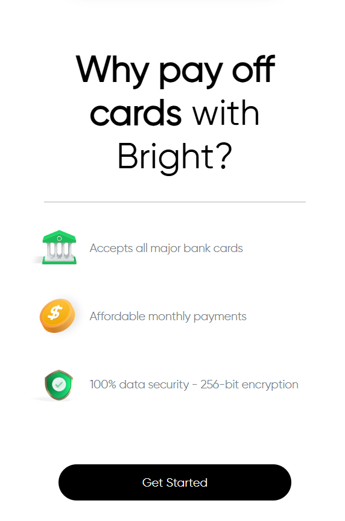
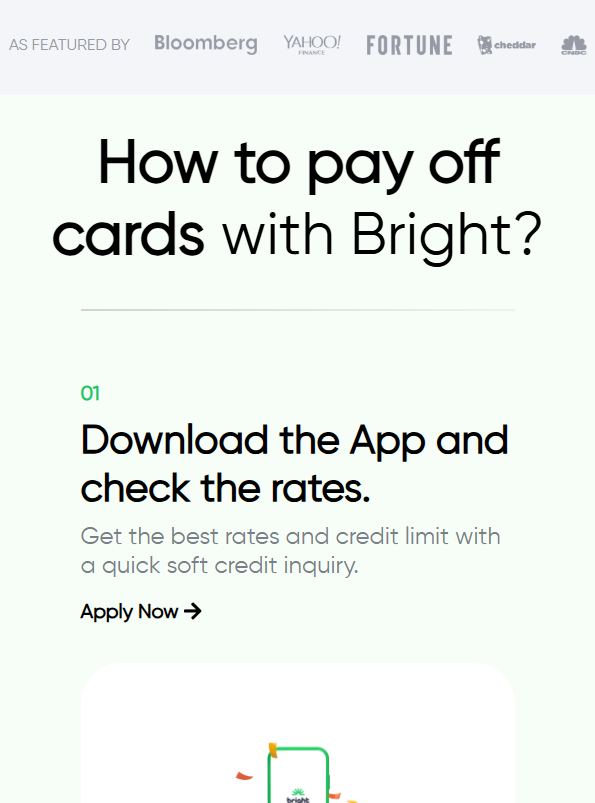
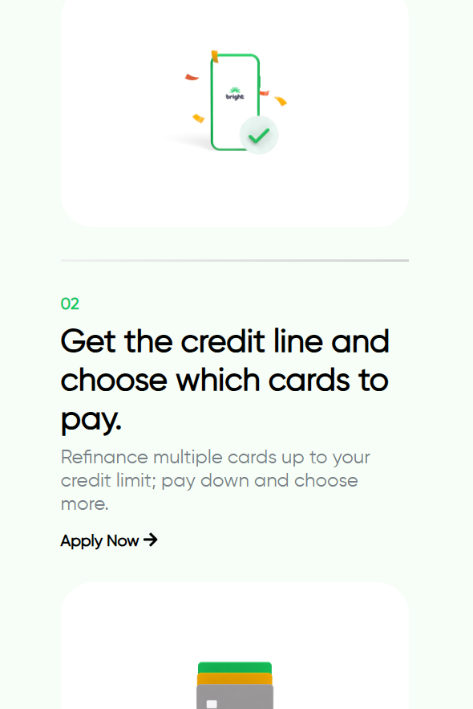
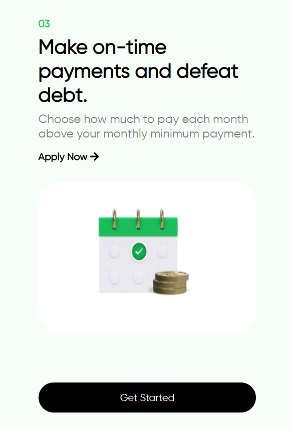
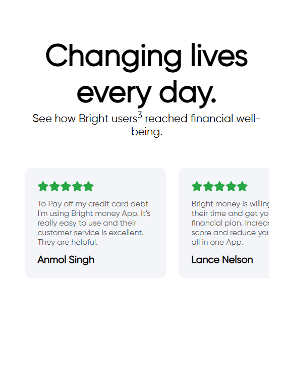
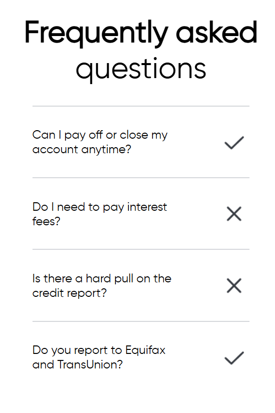
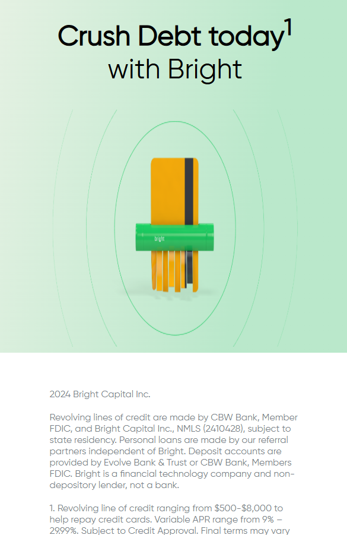


## 🚀 Live Demo  
🔗 https://brightmoneypm.netlify.app/

## 📂 Installation  
To run the project locally:  
```sh
git clone https://github.com/your-username/your-repo.git  
cd your-repo  
open index.html  
