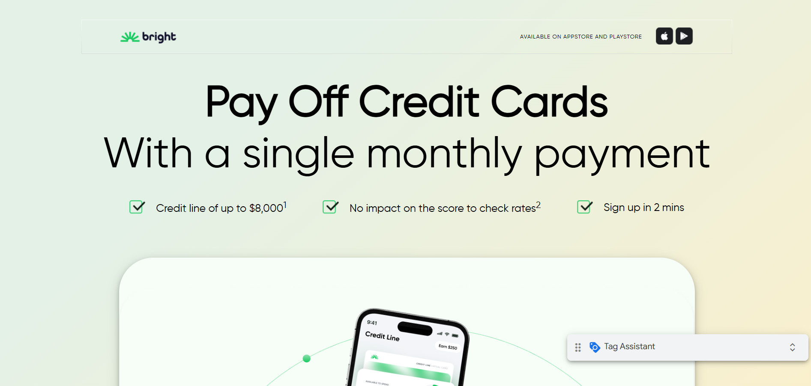
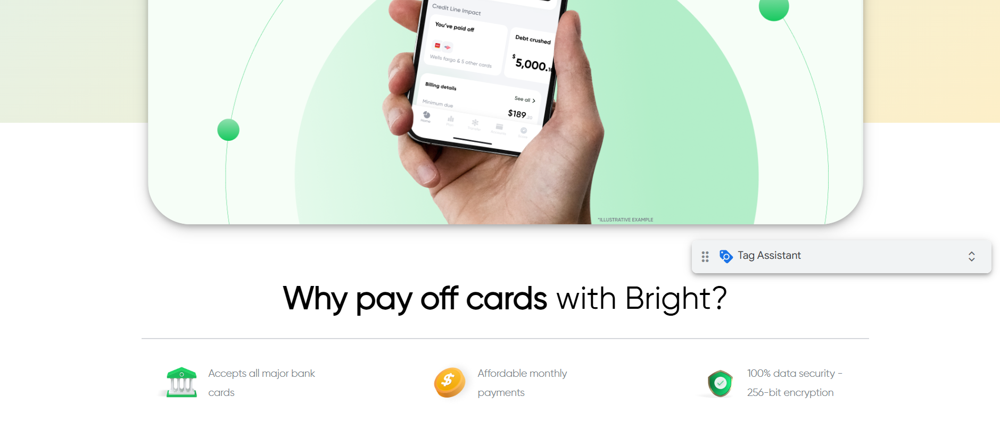
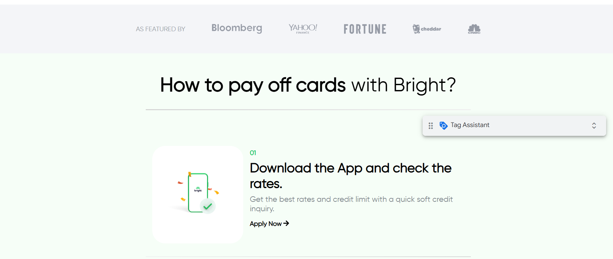
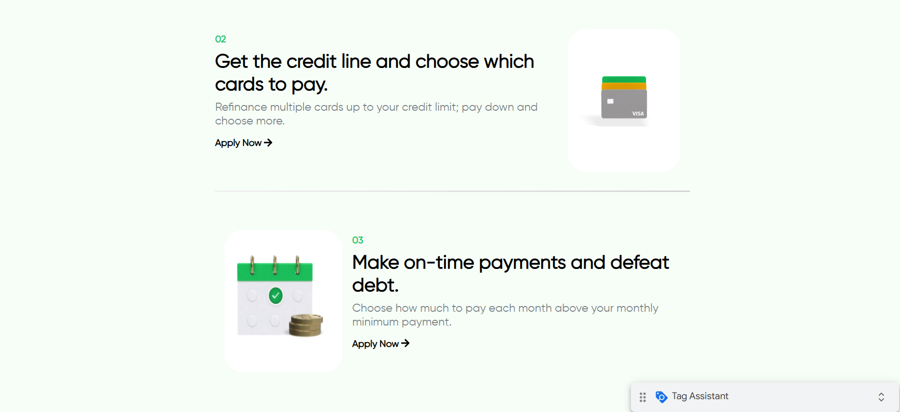
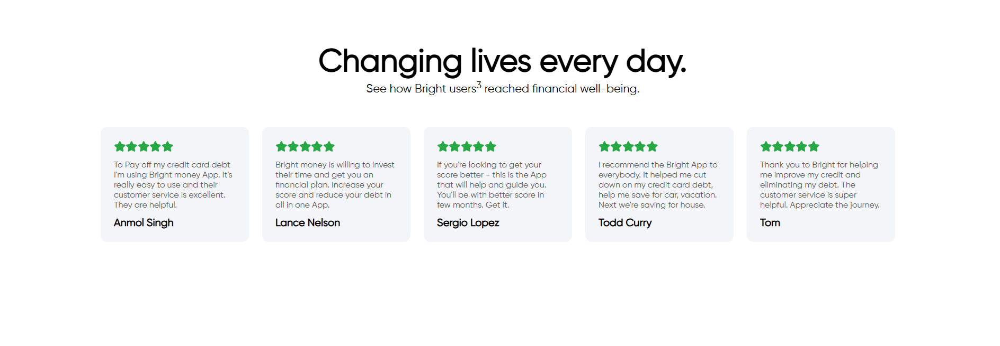
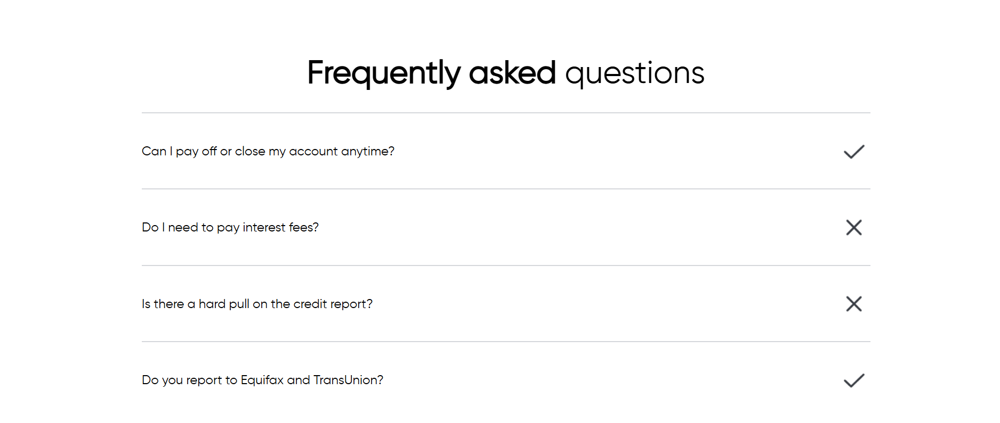
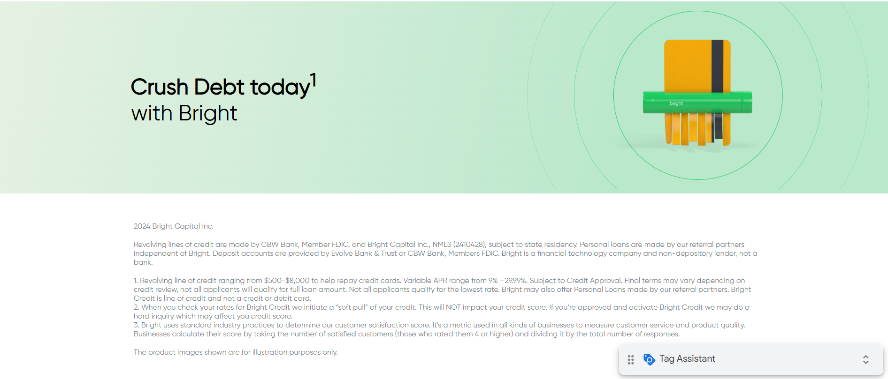

# Frontend Implementation of Assigned Task  

This is the frontend implementation of the assigned task.  
The website is **fully responsive** and built using **HTML, CSS, and JavaScript**.  

## 🌟 Features  
- Fully responsive design  
- Built with HTML, CSS, and JavaScript  
- Modern UI/UX  

## 📸 Screenshots  

### **Desktop View**  

  
  
  
  
  
  
  

### **Tablet View**  

  
  
  
  
  
  
  
  
  

### **Mobile View**  

  
  
  
  
  
  
  
  

## 🚀 Live Demo  
🔗 [Live Website](https://brightmoneypm.netlify.app/)
